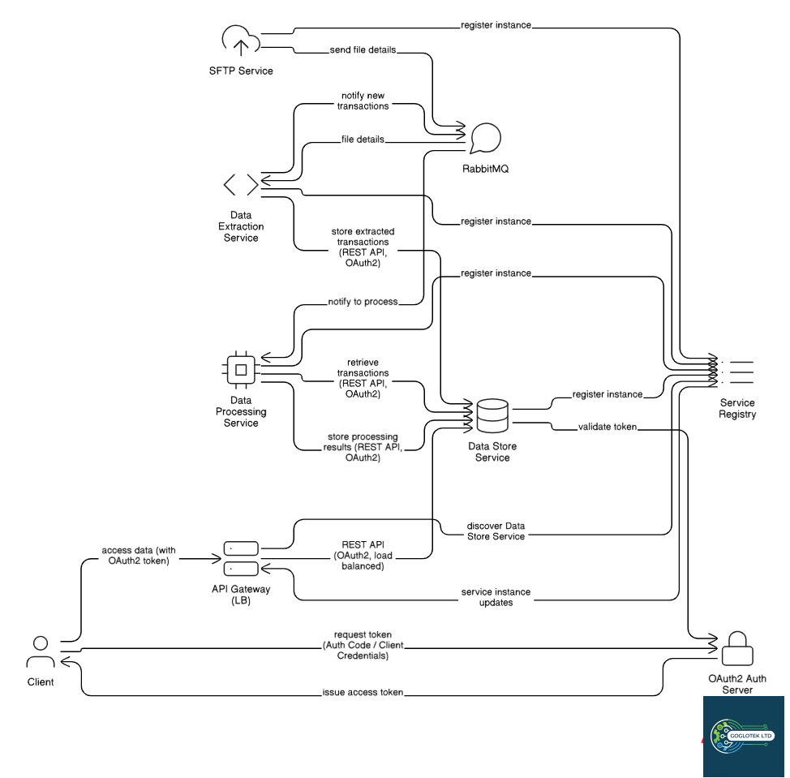
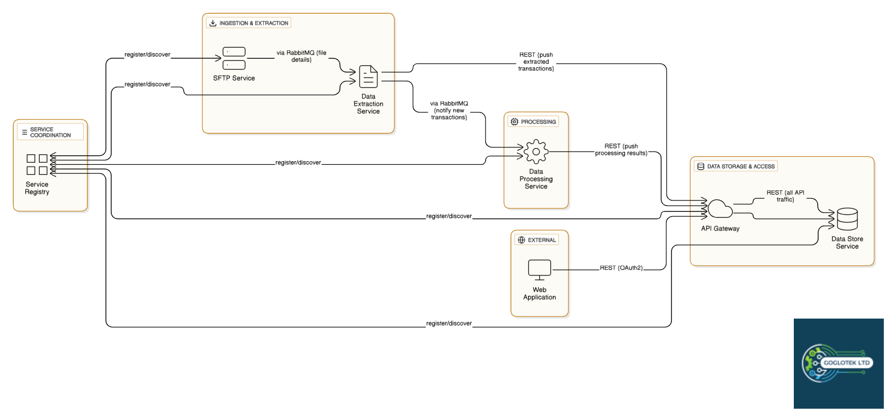

# Fraud Detector System  

An **open-source fraud detection system** built on **Java Spring Boot** and **Spring Cloud**, designed using a **microservice architecture**.  

This system is released under the **GNU General Public License (GPL)**.  
- **Open Source Usage**: Free to use, modify, and distribute under the GPL.  
- **Commercial Usage**: For production-grade implementations, enterprise features, and support, you must contract **Goglotek**. The commercial version includes additional features, enhanced performance, advanced security, and a polished UI.  

---

## 🚀 Features  

- **High throughput (TPS)** for fraud detection and transaction analysis.  
- **Modular microservice design** – services can be scaled and deployed independently.  
- **Open Source Core** – extendable architecture for integrating with your own UI, security, and data stores.  
- **RabbitMQ messaging** for service-to-service communication.  
- **REST APIs** for storing, retrieving, and processing transactions.  

⚡ The **commercial version** offers even faster processing, more scalability, and enhanced resilience.  

---

## 🏗️ System Architecture  

The system follows a **microservice architecture**, with the following core services:

### 1. SFTP Service  
- Fetches transactions from providers via **SFTP**.  
- Configurable to support other retrieval methods.  

### 2. Data Extraction Service  
- Extracts transactions from files.  
- **Open Source**: supports **CSV**.  
- **Commercial**: supports multiple file formats and alternative ingestion technologies.  

### 3. Data Processing Service  
- Processes transactions, flags fraudulent activities, missing data, and other discrepancies.  

### 4. Data Store Service  
- Stores and retrieves transactions.  
- **Open Source**: **PostgreSQL** database.  
- **Pluggable** with minimal code changes.  
- **Commercial**: supports **Redis caching**, **document databases**, and **big-column datastores**.  

### 5. Gateway Service  
- Proxies data store web services.  
- **Open Source**: built on **Spring Cloud Gateway**.  
- **Commercial**: includes **DoS protection**, **rate limiting**, and advanced security features.  

### 6. Service Registry  
- Registers services and enables **load balancing** in conjunction with the Gateway.  
- Built with **Eureka**.  

---

## 🔗 Communication & Data Flow  

- **Messaging**: Services communicate via **RabbitMQ**.  
- **Data Access**: Data is stored/retrieved via **REST APIs** exposed by the Data Store service.  

---

## 🎨 UI Module  

- The open-source system includes a **basic UI module** for **test purposes only**.  
- Users are encouraged to **implement their own UI** and fine-tune security for production use.  
- The **commercial version** includes a **full-featured, production-ready UI**, with improved usability and additional test coverage.  

---

## 📊 Open Source vs. Commercial  

| Feature             | Open Source Version         | Commercial Version                              |
|---------------------|-----------------------------|------------------------------------------------|
| Transaction Fetch   | SFTP only                   | Multiple protocols & formats                   |
| File Parsing        | CSV only                    | Any file format & provider APIs                |
| Data Store          | PostgreSQL                  | PostgreSQL, Redis, Document DB, Big Column DB  |
| Performance         | High TPS                    | Even faster TPS & scalability                  |
| Security            | Basic                       | Advanced (DoS mitigation, rate limiting, etc.) |
| UI                  | Basic (test only)           | Full production-ready UI                       |
| Test Coverage       | Standard                    | Extensive test cases & enterprise validation   |

## 💰 Donation
**Support this project:** [💖 Sponsor](https://github.com/sponsors/robmoi2010) · [💸 PayPal](https://www.paypal.com/donate/?hosted_button_id=P4FZ9XQ7K3GY2)

## 📞 Contact
Website: www.goglotek.com email: robmoi2010@gmail.com mobile: +254724116115
